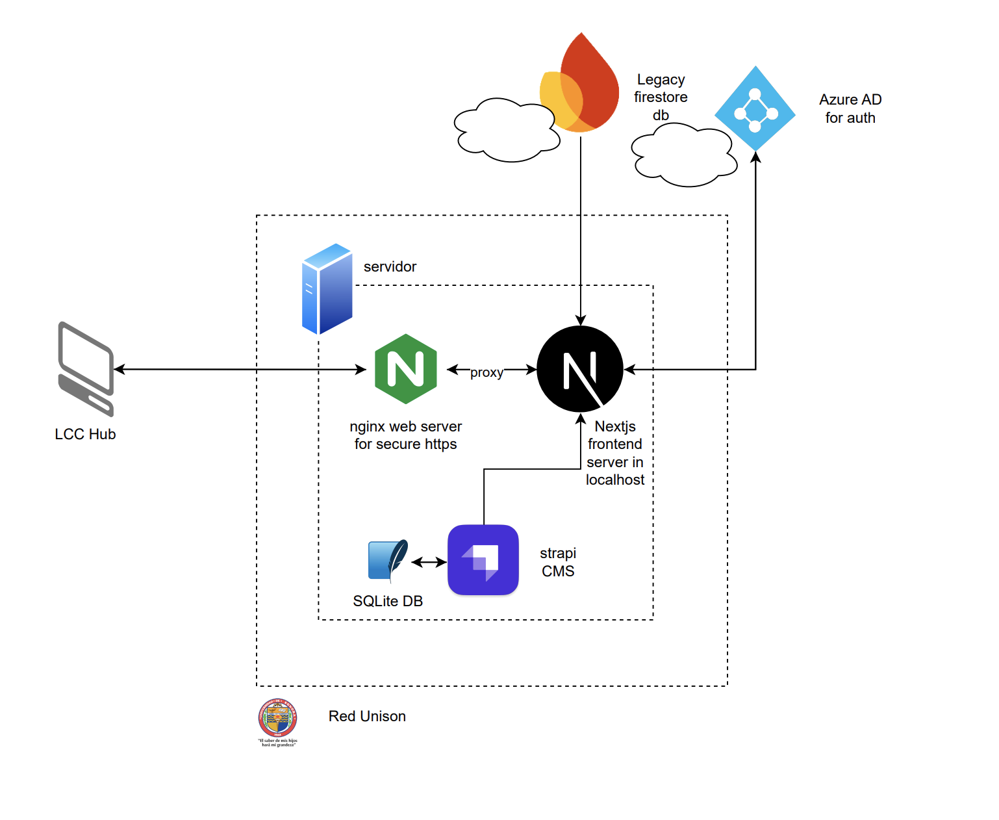

# **Guía de mantenimiento de la aplicación LCC Hub**

Bienvenido a la guía de mantenimiento de la aplicación LCC Hub. Aquí encontrarás información sobre cómo mantener y actualizar la aplicación, así como las tareas necesarias para garantizar su correcto funcionamiento.

## **Índice**

- [Arquitectura del sistema](#arquitectura-del-sistema)
- [Código fuente](#código-fuente)
- [Actualización de contenido](#actualización-de-contenido)
- [Deploy](#deploy)

## **Arquitectura del sistema**



Cuando alguien hace un GET request a la dirección `https://lcc-hub.unison.mx`, el DNS target manejado por informática redirige a la ip de un servidor en la red unison. En el servidor se encuentra corriendo un servidor de nginx que maneja el tráfico de la aplicación. El servidor de nginx redirige el tráfico a un servidor de `Nextjs` que corre la aplicación de frontend. La aplicación de frontend hace requests a un servidor de `Strapi` que sirve como CMS, API endpoints, y guarda los datos en una base de datos `SQLite`. Tambien se hace requests a un servidor legacy de un projecto pasado con datos de alumnos y materias en Firebase. Por último, la autenticación de la aplicación se maneja a través de una SPA de `Azure AD` a la cual tenemos acceso a traves de un token que pedimos en informática.

## **Código fuente**

El código fuente se divide en [Frontend](https://github.com/enriquegiottonini/lcchub-dev) y en [Backend](https://github.com/enriquegiottonini/lcchub-backend-dev). Para evitar duplicar información, se recomienda revisar los repositorios de cada parte para obtener información sobre como replicar en ambiente local.

## **Actualización de contenido**

Podrás actualizar el contenido de la aplicación para la sección de **_eventos_**, **_SoyLCC_**, y **_bolsa de proyectos_**. Para actualizar la información de los alumnos, mapa curricular, y otros datos de la base de datos, se recomienda contactar a la responsable del proyecto Edelmira Rodriguez, ya que es un proyecto aparte a este.

### **Requisitos**

1. Estar fisicamente en la Universidad de Sonora y conectarte a la red a través de un cable de red.
2. Credenciales para acceder a través de SSH al servidor de producción de la aplicación.

```bash
ssh usuario-xxxx@ip-xxxx -vvv # Para un log detallado
Ingrese la contraseña: xxxx
```

3. Acceso de administrador a la interfaz de Strapi (usuario y contraseña).

La actualización de contenido se realiza a través de la interfaz de administrador de Strapi. Para ello hacemos un jump a la dirección IP del servidor de producción para hacerle "creer" a nuestra computadora que tenemos acceso a una aplicación en la red local.

```bash
ssh -L 1337:localhost:1337 usuario-xxxx@ip-xxxx
```

Una vez que hayamos hecho el jump, abrimos un navegador y vamos a la dirección `http://localhost:1337/admin` para acceder a la interfaz de administrador de Strapi. Aquí podremos actualizar el contenido de la aplicación, restrucutrar la base de datos, y abrir REST API endpoints. Para más información sobre cómo utilizar Strapi, revisa la [documentación oficial](https://strapi.io/documentation/developer-docs/latest/getting-started/introduction.html).

## **Deploy**

El deploy se realiza accediendo al servidor de producción a través de SSH. Se ingresa al directorio el cual contiene dos repositorios, uno para el frontend y otro para el backend. Para actualizar la aplicación, se debe hacer un `git pull` en cada uno de los repositorios.

Para hacerle `build` al frontend y al backend, se debe correr el siguiente comando:

```bash
npm run build
```

Para correr la aplicación en modo producción se utiliza `pm2` para que la aplicación siga corriendo en el servidor aunque se cierre la terminal.

Corre desde el directorio raíz de cada repositorio:

```bash
pm2 start npm --name "lcchub-backend" -- start # Primero el backend
pm2 logs # Para monitorear que todo esté funcionando correctamente
```

```bash
pm2 start npm --name "lcchub-frontend" -- start # Luego el frontend
pm2 logs # Para monitorear que todo esté funcionando correctamente
```

Para asegurar que la aplicación se reinicie automáticamente en caso de fallo, se debe correr el siguiente comando:

```bash
pm2 startup
pm2 save
```

Para detener la aplicación, se debe correr el siguiente comando:

```bash
pm2 ls # Para ver los procesos corriendo
pm2 stop lcchub-backend
pm2 stop lcchub-frontend
```

Para más información sobre cómo utilizar `pm2`, revisa la [documentación oficial](https://pm2.keymetrics.io/docs/usage/quick-start/).
