# **Guía de uso de la aplicación LCC Hub**

Bienvenido a la guía de uso de la aplicación LCC Hub. Aquí encontrarás información sobre cómo utilizar la aplicación y las funcionalidades que ofrece.

## **Índice**

- [Sobre la aplicación](#sobre-la-aplicación)
- [Página de inicio](#página-de-inicio)
- [Sección de eventos](#sección-de-eventos)
- [SoyLCC](#soylcc)
- [Bolsa de Proyectos](#bolsa-de-proyectos)
- [Ingreso al Portal de alumnos](#portal-de-alumnos)
- [Mi Portal](#progreso-académico)

## **Sobre la aplicación**

La aplicación LCC Hub es una plataforma web dinámica que proporciona información relevante para los estudiantes de la Licenciatura en Ciencias de la Computación (LCC) de la Universidad de Sonora. A través de un Sistema de Gestión de Contenido (CMS), la plataforma ofrece un centro de información actualizable con secciones dedicadas a eventos, testimonios de egresados, oportunidades de trabajo y un portal de alumnos.

## **Página de inicio**

La página de inicio de la aplicación LCC Hub es el punto de entrada a la plataforma, donde los usuarios pueden acceder a las diferentes secciones y funcionalidades. La puedes encontrar en directamente en

> [https://lcc-hub.unison.mx/home](https://lcc-hub.unison.mx/home).

o a través del menú de navegación de:

> [https://cc.unison.mx/](https://cc.unison.mx/)

## **Sección de eventos**

La sección de eventos de la aplicación LCC Hub ofrece información detallada sobre eventos próximos y pasados relacionados con la Licenciatura en Ciencias de la Computación. Los eventos se clasifican en oficiales y comunitarios, y se presentan en un calendario facilitar la visualización y participación.

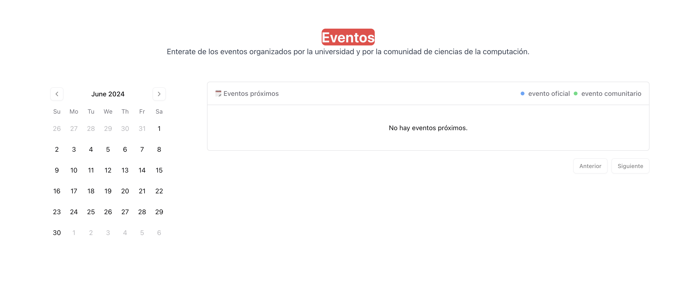

Los eventos oficiales son organizados por la o hacia la universidad (conferencias, talleres, etc.), mientras que los eventos comunitarios son organizados por la comunidad estudiantil (hackatones, torneos de volley, rompe hielos, etc.).

Un historial de todos los eventos publicados se encuentra en la sección de ["Eventos"](https://lcc-hub.unison.mx/home/eventos), accesible desde el menú de navegación en la barras superior. Los eventos están conformados por fechas, descripciones, lugar, quien aprobó la publicación, y si es oficial o comunitario.

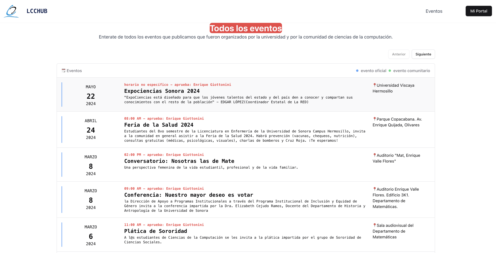

## **SoyLCC**

La sección de "SoyLCC" es una galería de videos de egresados de la Licenciatura en Ciencias de la Computación que comparten sus experiencias y logros después de graduarse. Estos testimonios inspiran a los estudiantes actuales y les brindan una perspectiva de las posibilidades y oportunidades que ofrece la carrera.

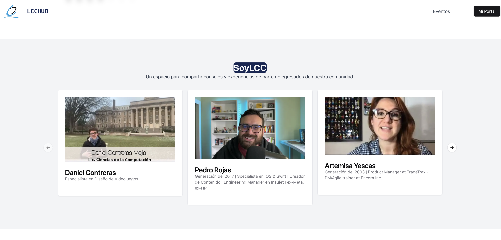

Al dar clic en la imagen de un egresado se redirige a un video de YouTube donde el egresado comparte su experiencia. Los videos son seleccionados por el equipo de servicio social de LCC Hub y se actualizan a medida que se recopilan más testimonios.

## **Bolsa de Proyectos**

La sección de "Bolsa de Proyectos" es un espacio dedicado a compartir oportunidades de trabajo, prácticas y otros eventos relevantes para la experiencia profesional de los estudiantes de la Licenciatura en Ciencias de la Computación.

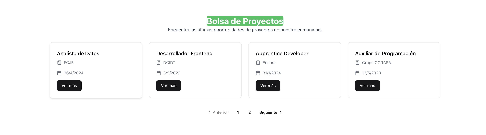

Al hacer clic en "Ver más" se abrirá una ventana emergente con más detalles sobre el proyecto, o se redirigirá a la página oficial del proyecto. Los proyectos son seleccionados e idealmente verificados por el equipo de servicio social de LCC Hub.

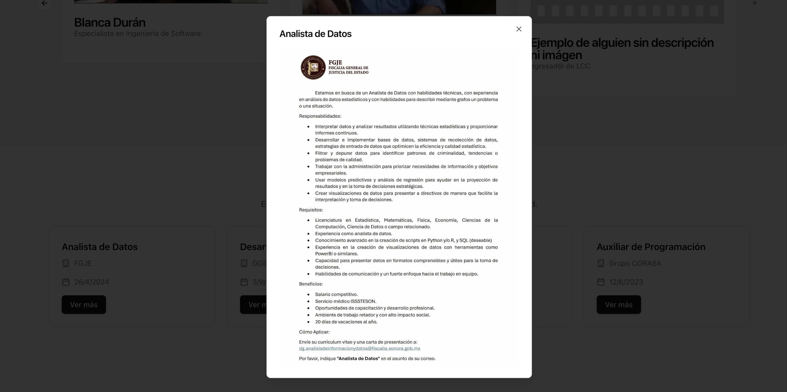

## **Portal de alumnos**

El portal de alumnos de la aplicación LCC Hub "Mi Portal" es una sección integrada con Azure AD que ofrece a los estudiantes acceso seguro a su información académica. Los estudiantes pueden consultar su progreso, materias aprobadas, créditos acumulados y otra información relevante para su trayectoria académica. Para acceder al portal de alumnos, los estudiantes deben autenticarse con sus credenciales de la Universidad de Sonora.

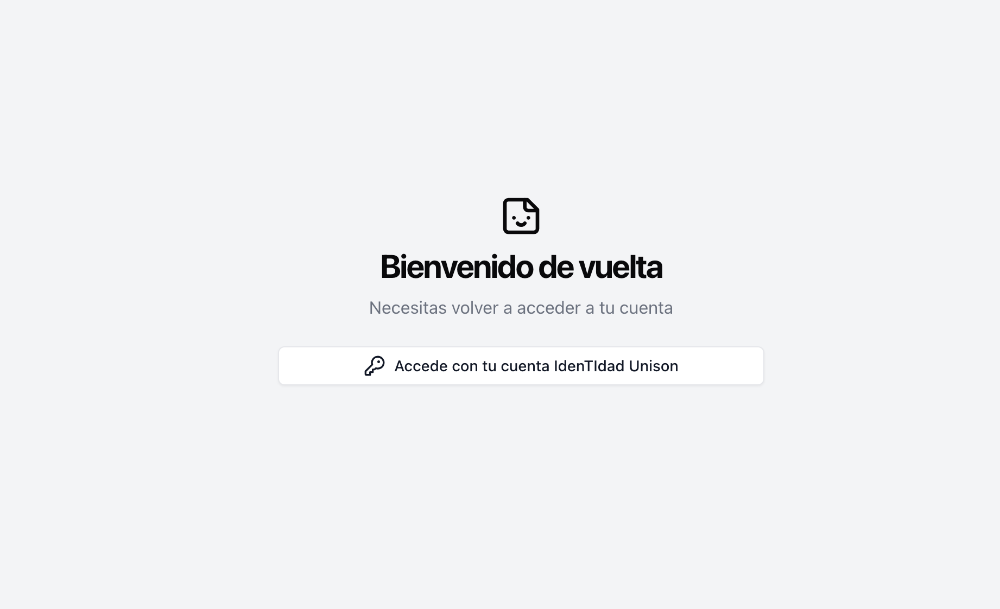

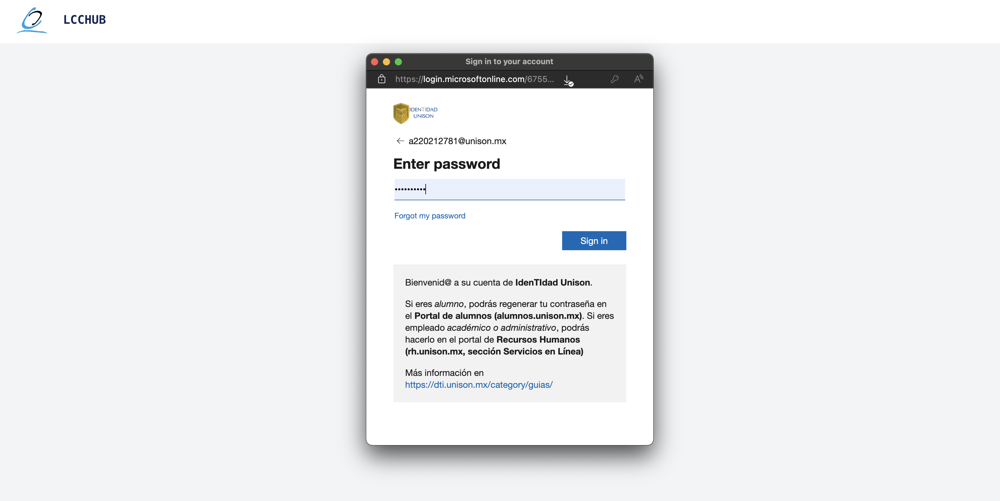

Ingresando con tus credenciales de la Universidad de Sonora, podrás acceder a tu información académica y personalizada. En caso de intentar acceder con credenciales incorrectas, se mostrará un mensaje de error y se te pedirá que vuelvas a intentarlo.

Podrás regresar a la página de inicio en cualquier momento haciendo clic en el logo de LCC Hub en la esquina superior izquierda de la pantalla.

## **Mi Portal**

Una vez autenticado en el portal de alumnos, podrás acceder a tu información académica personalizada. La página principal de "Mi Portal" se divide en dos secciones principales: "Mi Progeso" y "Mapa Interactivo".

### **Mi Progreso**

La sección de "Mi Progreso" muestra un resumen de tu trayectoria académica, incluyendo el número de materias aprobadas, créditos acumulados, promedio general y más. Puedes consultar esta información en cualquier momento para tener una visión general de tu progreso académico.

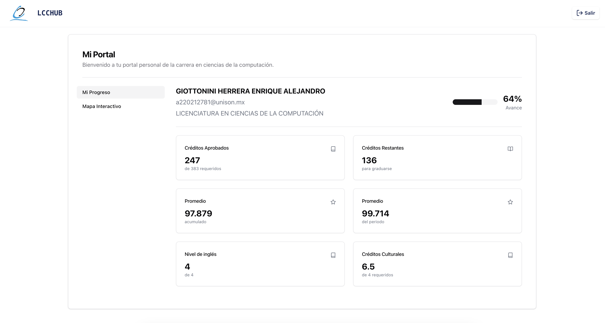

### **Mapa Interactivo**

El "Mapa Interactivo" es una herramienta visual que muestra las materias de la Licenciatura en Ciencias de la Computación.

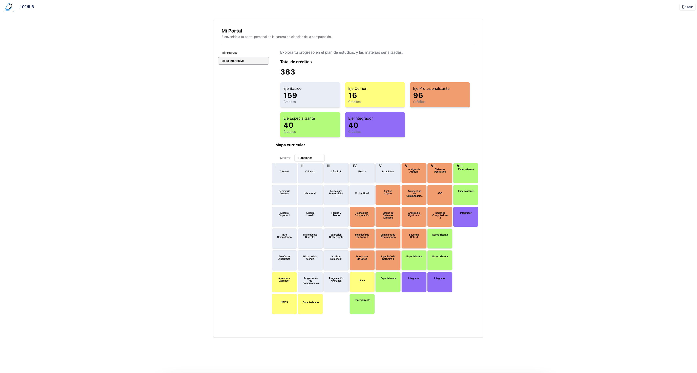

Al hacer clic en el título de una materia, se desplegará información detallada sobre la materia, incluyendo su nombre, clave, créditos, requisitos, y más.

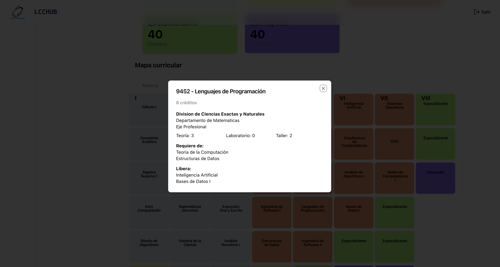

Y al hacer clic en una materia pero sin que sea el título, se mostrará la serie de materias que dependen entre sí en la que se encuentra la materia seleccionada.

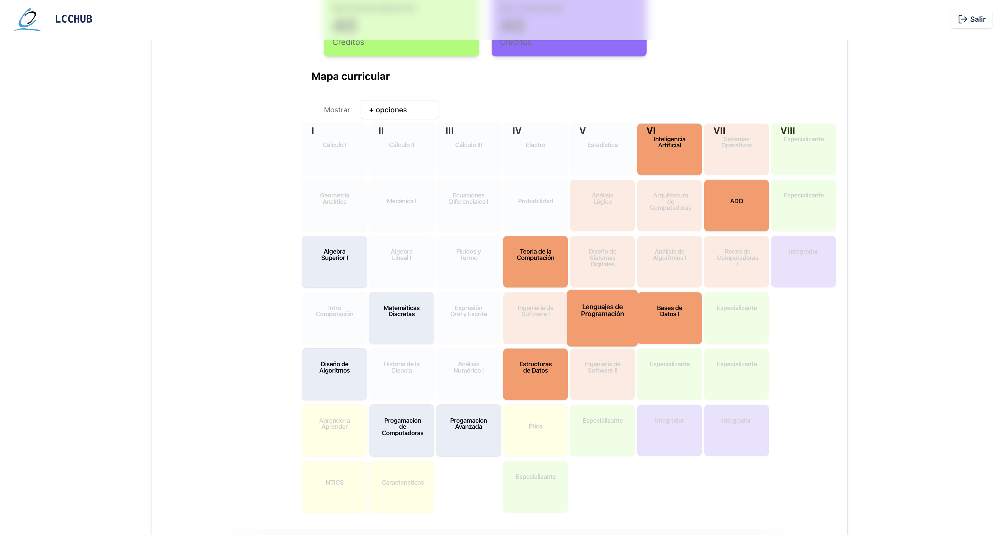

Tambien se incluye un menú para filtrar las materias por estado (aprobadas, bajas, inscrítas, reprobadas, y última oportunidad de inscripción).

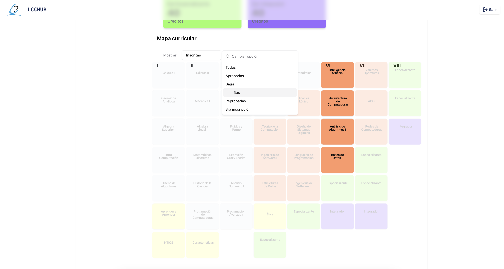

Se puede regresar a la página de inicio en cualquier momento haciendo clic en el logo de LCC Hub en la esquina superior izquierda de la pantalla, e ingresar sin necesidad de autenticarse ya que la sesión se mantiene activa. Para cerrar la sesión, se debe hacer clic en el botón de "Salir" en la esquina superior derecha de la pantalla.
